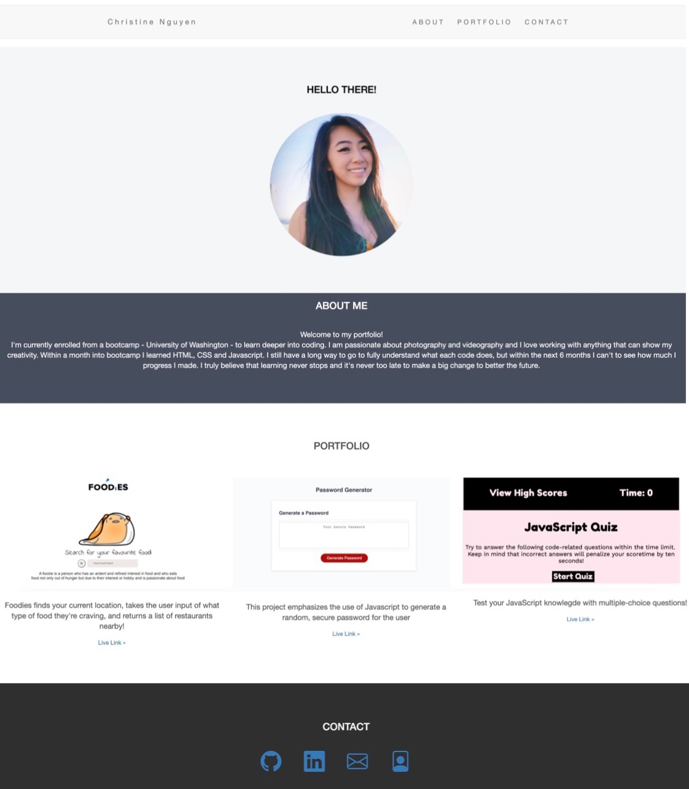

# Updated-Portfolio

# Portfolio

## Hi there, I'm Christine and welcome to my portfolio!
I have a long history with being involved with coding, when MySpace was a thing before Facebook became popular. You were known as the *"cool kid"* if you knew how to make your profile by adding banners, gifs, background images, music and etc. A few years later I was still involved with coding because Tumblr. At the time I never thought about coding could be a career because growing up in my family we told to only be engineers, doctors or business.

As I got older it was time to decide what I wanted to do with my career path. I chose to do accounting... I didn't feel passionate with the path I chose and I knew it was time for a change to better my future. I decided to enroll from a coding bootcamp - University of Washington - to learn deeper into coding. 

I am passionate about photography and videography and I love working with anything that can show my creativity. Within four months into bootcamp I learned HTML, CSS, JavaScript, API, Node.js, Express.js, MySQL, Sequelize, and Handlebars. The end of this program I can't to see how much I progress I made. I truly believe that learning never stops and it's never too late to make a big change to better the future.

## Let's jump into why portfolio's are important ✨
A portfolio tells the story about a person, the character, and the journey to overcome certain challenges through their work. Displaying your skills and abilities through storytelling is the best way to make that connection and display your value. 

## Here are some examples that can be added into your portfolio:

**1. Bio/About section**
- This should include your name, a photo, and a paragraph about who you are, what you've done, and where you'd like to go next. Don't be afraid to dive into detail on your portfolio. Your hobbies and personality quirks are what make you, you!

**2. Projects section**
- Showcase some projects you've worked on, so you'll want to make sure this section **POP!** By highlighting different examples of your work, you can demonstrate a depth and breadth of skill. To this end, your work can speak for you.

**3. Relevant social media profiles**
- For developers, there are two social media networks that are basically non-negotiable:
1. GitHub
2. Linkedin
3. Email address
4. Resume

**Once again, portfolios are all about demonstrating your technical skills, and creativity as a developer.**

The link below shows my portfolio:
[Christine's Portfolio](https://ctinengyn.github.io/Updated-Portfolio2/)
